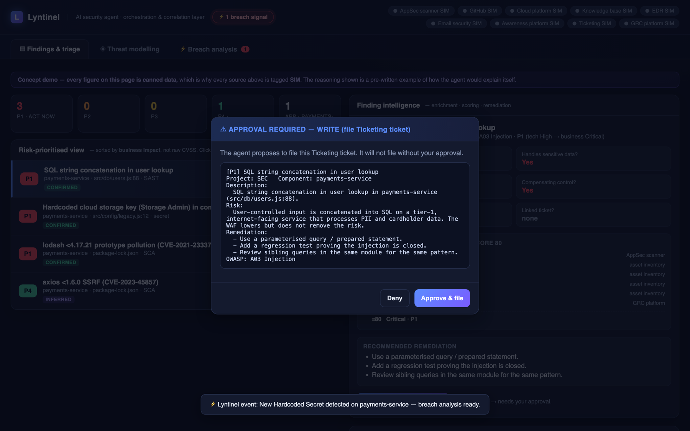
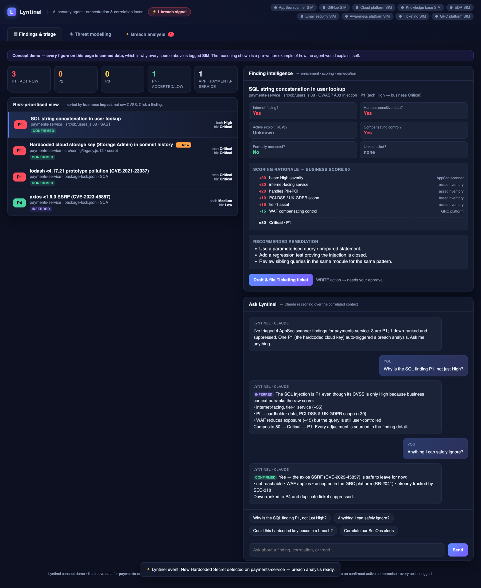
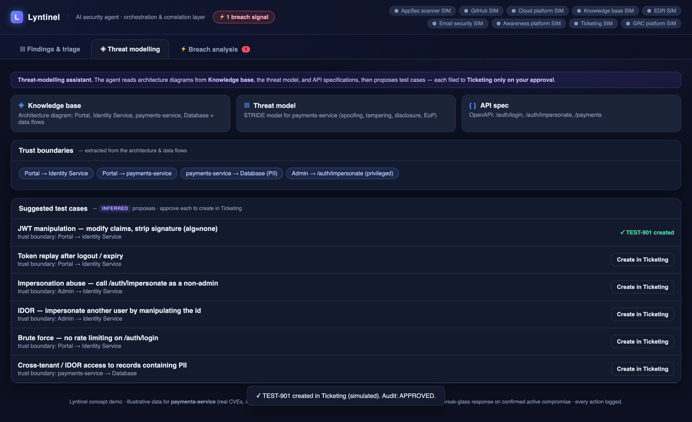
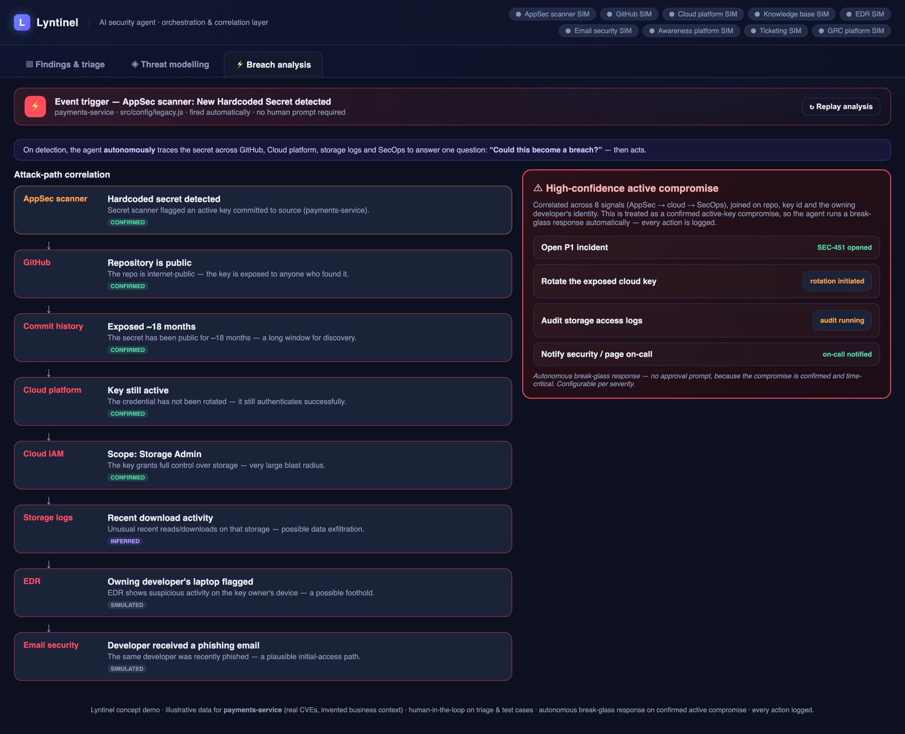

# Lyntinel - an AI security sentinel 

**I built Lyntinel to demonstrate what AI can do in security work without outsourcing the thinking.**

It's a prototype AI security agent that sits on top of the tools a security team already runs and handles the correlation, prioritisation and triage work that falls between them. It augments the security stack: it doesn't replace the vetted tools a team relies on, or the judgement of the people running them.



*The agent proposes; a human decides. Nothing is filed until someone clicks Approve.*

---

## What Lyntinel is

Security signal is scattered across tools. An AppSec scanner knows a dependency is vulnerable, but not whether the service is internet-facing. The EDR knows a laptop ran something odd, but not that its owner clicked a phishing link two minutes earlier. The risk register knows a finding was formally accepted but the scanner keeps raising it anyway.

Lyntinel is an **orchestration and correlation layer** over those tools. It doesn't scan anything itself. It reads from the systems a team already has (AppSec scanner, source control, ticketing, GRC platform, asset inventory, EDR, email security, awareness platform) and does the joining work that analysts otherwise do by hand:

- **Enriches** each finding with business context. Is the service internet-facing? Does it handle sensitive data? Is the vulnerability actively exploited? Is there a compensating control? Has the risk already been accepted, or a ticket opened?
- **Prioritises** by business impact (P1–P4) rather than raw CVSS, and traces every point of the score back to its source.
- **Correlates** AppSec, cloud and SecOps signals into a single incident.
- **Drafts** developer-ready remediation and tickets.
- **Stops at a human** before anything is written, filed or changed.

It comes in two parts:

| | What it is | How to see it |
|---|---|---|
| **The agent** | Five runnable Python scenarios on simulated data: triage, correlation, trends, threat modelling and review prep | `python3 -m scenarios.appsec.run` |
| **The dashboard** | An interactive concept of the analyst's view, built on canned data | `dashboard/dashboard.html`. See the [tab-by-tab walkthrough](#the-dashboard-tab-by-tab) |

---

## Why it was built

AI looks like an obvious fit for security operations, because there is too much signal and not enough people. Security engineers are rightly sceptical of it, though, and their objections are good ones:

1. *It will take unsafe actions on its own.*
2. *It will hallucinate findings, and a confident wrong answer is worse than no answer.*
3. *Our data will leave the organisation.*
4. *Securing an AI agent is a big job in its own right.*

Lyntinel was built to answer those objections with working software rather than slides. Each objection became a design constraint you can find in the code:

| Objection | How the design answers it | Where |
|---|---|---|
| Unsafe autonomous actions | Reads are free. Every WRITE or DESTRUCTIVE action blocks at an approval gate, and every action lands in the audit trail, refusals included | `core/safety.py` (`ApprovalGate`) |
| Hallucinated findings | Every claim carries an evidence label: `CONFIRMED`, `INFERRED`, `UNKNOWN` or `SIMULATED`. A guess cannot render as a fact, and an `UNKNOWN` goes to a human instead of into a ticket | `core/safety.py` (`EvidenceStatus`) |
| Data leaving the org | Every run ends with a data-boundary report of what left the machine | `core/safety.py` (`DataBoundary`) |
| Securing the agent | Named as real, unfinished work rather than pretended away | [`docs/limitations.md`](docs/limitations.md#7-securing-the-agent-itself-is-only-partly-addressed) |

The safety controls aren't a tax on the agent; they're what makes it shippable in a security team.

---

## Purpose: augment, don't outsource

The split between what the agent does and what people decide is deliberate:

| The agent does the legwork | People keep the judgement |
|---|---|
| Reads a dozen consoles and joins them on asset, identity and time | Decide whether a ticket gets filed |
| Calculates a business-impact score and shows every point of it | Challenge the scoring weights, which all sit in one small file (`core/scoring.py`) |
| Drafts remediation, ticket text and threat-model test cases | Choose which test cases are worth running |
| Proposes containment for an incident | Approve or refuse the quarantine |

AI is good at the tedious joining work: it can hold many sources in view at once and produce a draft. It is not accountable for the decision, so it doesn't get to make it. Every design choice in this repo follows from that.

To be clear about one thing: **the reasoning in the runnable agent is deterministic, rule-based Python, not a language model.** That's deliberate. It runs offline, gives the same answer every time in front of an audience, and every decision can be audited line by line. A model would slot in at defined seams (enrichment reasoning, remediation drafting and threat suggestions), behind the same gates, evidence labels and data boundary. The scaffolding is the point, not the model.

---

## The dashboard, tab by tab

`dashboard/dashboard.html` shows what the agent would look like to an analyst. It is a **concept demo**. Every figure is canned data for a fictional `payments-service` (real CVEs, invented business context), and every source in the header is labelled **SIM**. The "Claude reasoning" answers are pre-written examples of how the agent would explain itself.

### 1. Findings & triage

**The question it answers:** *Of everything the scanners found, what actually needs fixing first, and why?*



- **Risk-prioritised view:** four findings sorted by **business impact, not CVSS**. Each one shows its evidence label and two scores side by side: *tech* (what the scanner says) and *biz* (what it means for this business).
- **Finding intelligence** (click any finding):
  - **Context questions**, answered from other tools: Internet-facing? Sensitive data? Active exploit (KEV)? Compensating control? Formally accepted? Linked ticket? If an answer isn't known, the panel shows **Unknown** rather than a convenient default.
  - **Scoring rationale**, with every point sourced. For the SQL injection finding: base High +30, internet-facing +20, handles PII and card data +20, in PCI-DSS / UK-GDPR scope +10, tier-1 asset +15, WAF compensating control −15. Total: **80, which is Critical and P1**.
  - **Recommended remediation**, plus a **Draft & file ticket** button. Filing is a WRITE action, so it needs your approval.
- **Ask Lyntinel:** a chat panel over the correlated context, with answers that carry evidence labels and cite their sources. Ask *"Anything I can safely ignore?"* and it answers `CONFIRMED`: the axios SSRF is unreachable, a WAF applies, the risk is formally accepted in the register, and a ticket already tracks it. It gets down-ranked to P4 and the duplicate ticket is suppressed.

**What it shows:** prioritisation that uses business context a scanner can't see. A *High* SQL injection rises to P1 because it sits on an internet-facing service that handles card data. A *Medium* SSRF falls to P4 because it is unreachable and already accepted. Nothing gets filed until a human says yes.

**Run the real logic:** `python3 -m scenarios.appsec.run`

### 2. Threat modelling

**The question it answers:** *Given how this system is built, what should we be testing?*



- **Three inputs:** an architecture diagram with its data flows (from the knowledge base), a STRIDE threat model for `payments-service`, and an OpenAPI spec.
- **Trust boundaries**, extracted from the architecture and data flows:
  - Portal → Identity Service
  - Portal → payments-service
  - payments-service → Database (PII)
  - Admin → `/auth/impersonate` (privileged)
- **Six suggested test cases**, each tied to the trust boundary it tests:
  - JWT manipulation: modify claims, strip the signature with `alg=none`
  - Token replay after logout or expiry
  - Impersonation abuse: calling `/auth/impersonate` as a non-admin
  - IDOR: impersonate another user by manipulating the id
  - Brute force against a login with no rate limiting
  - Cross-tenant / IDOR access to records containing PII

Every test case is labelled **`INFERRED`**, because it's a proposal and not a finding. Each has a **Create in Ticketing** button, and nothing is created until an engineer approves it.

**What it shows:** AI as a prompt for the engineer's thinking, not a replacement for it. The agent does the methodical part, mapping each trust boundary against the threat model, so that routine cases are covered and the engineer's time goes on the ones that need real thought. The engineer decides which tests matter.

**Run the real logic:** `python3 -m scenarios.threatmodel.run`

### 3. Breach analysis

**The question it answers:** *Could this new finding become a breach, and is it one already?*



- **Event trigger:** the AppSec scanner detects a new hardcoded secret in `payments-service`, and the analysis starts automatically without anyone asking. A breach-signal badge in the header announces it.
- **Attack-path correlation:** the agent traces the secret across source control, the cloud platform, storage logs and SecOps. Each link in the chain carries its own evidence label:

| # | Source | Signal | Evidence |
|---|---|---|---|
| 1 | AppSec scanner | An active key committed to source | `CONFIRMED` |
| 2 | GitHub | The repository is public | `CONFIRMED` |
| 3 | Commit history | Exposed for about 18 months | `CONFIRMED` |
| 4 | Cloud platform | The key is still active and has never been rotated | `CONFIRMED` |
| 5 | Cloud IAM | Scope is Storage Admin, a very large blast radius | `CONFIRMED` |
| 6 | Storage logs | Unusual recent downloads, a possible exfiltration | `INFERRED` |
| 7 | EDR | The owning developer's laptop is flagged | `SIMULATED` |
| 8 | Email security | The same developer was recently phished | `SIMULATED` |

- **Verdict:** a high-confidence active compromise, correlated across eight signals and joined on the repo, the key id and the developer's identity.
- **Break-glass response:** the agent opens a P1 incident, rotates the exposed key, audits the storage access logs and pages on-call, all **without an approval prompt**. Every action is logged, and the threshold is configurable per severity.

**What it shows:** the one deliberate exception to human-in-the-loop, and where the line for autonomy sits. The exception applies only when a compromise is **confirmed** and **time-critical**. It covers **containment and notification** steps only. It is **logged**, and it is **configurable**. When an active admin key is sitting in a public repo, waiting for someone to approve the rotation is itself the risk. Because each link carries its label, a reviewer can still see which parts of the case are proven and which are inferred.

> **This is a concept.** Break-glass exists in the dashboard as a design only. In the runnable agent, every WRITE and DESTRUCTIVE action is gated with no exceptions, including host quarantine.

**Run the nearest real logic:** `python3 -m scenarios.infra.run`. It correlates an EDR alert, an email click log and a user-risk profile into one incident, then stops at a quarantine you can refuse.

---

## Run it

Needs Python 3.9 or later (on Windows, use `py` in place of `python3`). There's no setup and no `pip install`, and everything runs offline:

```bash
git clone https://github.com/Lhod789/lyntinel.git
cd lyntinel
```
**The dashboard:**

```bash
python3 -m http.server 8931 --directory dashboard
```

Then open <http://localhost:8931/dashboard.html>

| Command | What it does |
|---|---|
| `python3 -m scenarios.appsec.run` | AppSec triage, enrichment, business-impact scoring and gated ticket filing |
| `python3 -m scenarios.infra.run` | Correlates EDR, email and user-risk signals into one incident, with a gated quarantine |
| `python3 -m scenarios.trends.run` | A weekly security summary: what moved and who's behind |
| `python3 -m scenarios.threatmodel.run` | Threats and test cases from the architecture and threat model |
| `python3 -m scenarios.review.run` | A prep pack for a security review: outstanding risks and questions to ask |

**Run the first two interactively.** Approve one ticket and refuse another, then refuse the quarantine and watch the audit trail log `DENIED`. Add `--auto` to either one to approve everything without prompts.

---

## Tests

```bash
python3 -m unittest discover -s tests -t .
```

There are 97 tests, all standard library and fully offline. They test the project's **claims** rather than chasing line coverage:

- No WRITE or DESTRUCTIVE action runs without an explicit yes.
- An unanswerable question stays `UNKNOWN` instead of becoming a convenient default.
- Business context can outrank raw CVSS.
- Simulated data always says so: in the terminal output, in the mock files and on the dashboard.
- The connectors cannot reach the network, so the demo stays offline.
- The repo stays clean: no committed credentials, and every integration is named by category, never by vendor.

---

## How it was built: AI-assisted, human-owned

I built Lyntinel with an AI coding assistant (Claude Code), under the same rule the product follows: **the AI drafts and a human decides.**

[`CLAUDE.md`](CLAUDE.md) is the working agreement the assistant operates under: a branch for every change, the full test suite before and after, tests in the same commit as the code they cover, a pull request for everything, and **a human merges**. The assistant never merges its own work.

The judgement calls stayed with me: the threat model, what counts as evidence, which actions are gated, what the scoring weights mean, and what was safe to publish. Any rule important enough to be at risk of being forgotten is pinned as a test rather than left as a habit.

---

## Limitations

This is a capability demonstration, not a production system: every source is simulated, the data is fictional, and nothing is actually written anywhere. Everything that's simulated, unbuilt or still an open problem is listed in [docs/limitations.md](docs/limitations.md).

---

## Layout

```
lyntinel/
  core/            safety.py (approval gate, evidence labels, data boundary),
                   scoring.py (business-impact score), report.py
  scenarios/
    appsec/        connectors, enrichment, developer assistant, run
    infra/         EDR + email + user-risk correlation
    trends/        weekly summary
    threatmodel/   threats and test cases
    review/        security-review prep pack
  data/mock/       labelled mock data for every source
  docs/            limitations, screenshots
  dashboard/       dashboard.html (concept demo)
  tests/           97 tests, standard library only
```